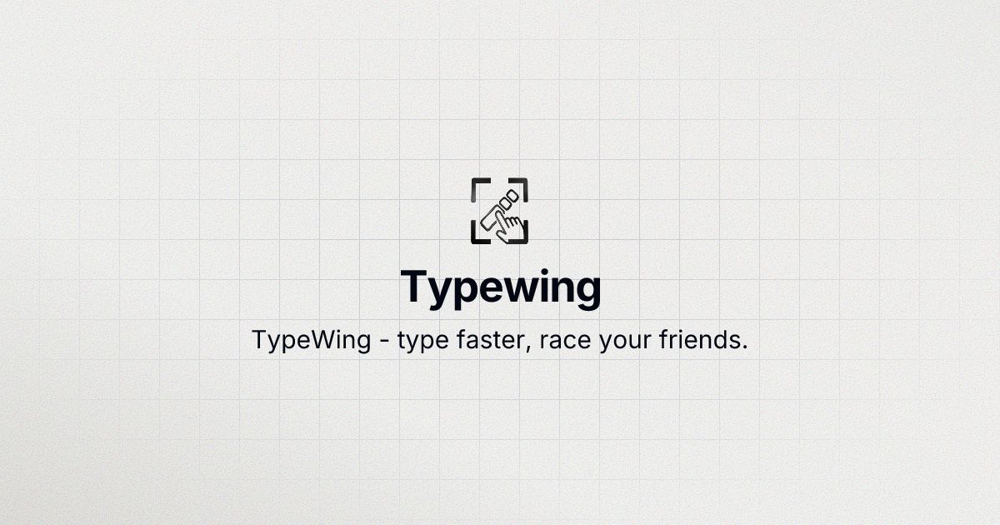
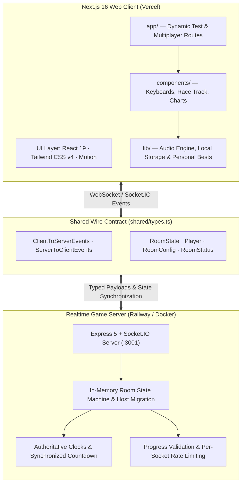

<div align="center">

# TypeWing

**A minimalist, high-performance typing test & real-time multiplayer racing platform.**

<br />



<br />
<br />

[**Live Demo**](https://type-wing.vercel.app) • [**Features**](#features) • [**Architecture**](#architecture) • [**Getting Started**](#getting-started) • [**Deployment**](#deployment--self-hosting)

<br />


         

</div>

---

## Overview

**TypeWing** is an open-source typing platform engineered for speed, aesthetic precision, and live competition. Built with **Next.js 16 (App Router)**, **React 19**, **Tailwind CSS v4**, and an authoritative **Socket.IO** realtime engine, TypeWing delivers an ultra-responsive, distraction-free typing experience.

Measure your raw WPM and accuracy in solo trials, listen to realistic mechanical switch acoustic feedback, track your personal best records locally, and create multiplayer rooms to race up to 8 racers in real time — with zero account creation or setup required.

---

## Features

### Precision Solo Typing Engine

- **Multiple Test Modes** — Practice with time limits (`15s`, `30s`, `60s`, `120s`), word targets (`10`, `25`, `50`, `100`), or curated quotes.
- **Stroke-by-Stroke Analytics** — Real-time WPM, raw WPM, accuracy percentages, character status highlights, and error tracking.
- **Performance Graphs** — Interactive post-test speed and accuracy charts powered by Recharts, complete with local Personal Best (PB) baseline markers.

### Real-Time Multiplayer Races

- **Instant Rooms** — Create or join custom rooms with a lightweight 6-character room code.
- **Live Visual Race Track** — Race up to 8 players side-by-side with smooth progress animations, synchronized countdowns, and live spectator capabilities.
- **Authoritative Server Engine** — Server-owned timers, rate limiting, and progress validation to ensure fair competition.
- **Live Leaderboard & Rematches** — Instant ranking upon completion with one-click rematch voting.

### Dynamic Virtual Keyboard

- **Dual Visual Styles** — Toggle between a **Sculpted Mechanical** keyboard or a **Mac Chiclet** keyboard layout.
- **Interactive Lighting** — Visual keypress highlights synchronize in real time as you strike physical keys.
- **Multilingual Keymaps** — Support for **QWERTY (English)**, **AZERTY (French)**, and **QWERTZ (German)** layouts.

### Mechanical Switch Soundscapes

- **High-Fidelity Switch Audio** — Procedural keyboard sound engine reproducing authentic keystroke audio profiles:
  - **Cherry MX Blue** (Clicky, tactile)
  - **Cherry MX Red** (Linear, smooth)
  - **Gateron Brown** (Tactile bump)
- **Audio Controls** — Adjustable volume sliders and one-click mute toggles.

### Deep Customization & Aesthetics

- **19 Curated Accent Colors** — Teal, Red, Amber, Purple, Green, Rose, Blue, Orange, Cyan, Pink, Indigo, Lime, Violet, Sky, Coral, Mint, Gold, Lavender, and more.
- **12 Typography Styles** — Monospace (Geist Mono, JetBrains Mono, Fira Code, Space Mono, Roboto Mono, Source Code Pro), Clean Sans (Inter, Poppins, Outfit, Space Grotesk), and Serif (Playfair Display, Caveat).
- **Dark & Light Modes** — Smooth, flicker-free theme switching built with `next-themes`.
- **Privacy-First** — No accounts or trackers required. All personal records and visual settings persist securely in `localStorage`.

---

## Architecture

TypeWing uses a decoupled architecture: a modern Next.js client paired with a lightweight, standalone Socket.IO game server. Both layers share a unified TypeScript wire contract in `shared/types.ts`, ensuring zero protocol drift.



- **`app/` · `components/` · `lib/`** — Next.js 16 frontend running on Vercel. Validates race outcomes locally before committing to results.
- **`server/`** — Express 5 + Socket.IO server running on port `3001` (containerized for Railway/Docker). Authoritative host transfers, rate limiting, and room lifecycles.
- **`shared/types.ts`** — The single source of truth for `ClientToServerEvents` and `ServerToClientEvents` shared across client and server.

---

## Tech Stack

| Domain                  | Technologies                                                                                                                                | Details                                      |
| :---------------------- | :------------------------------------------------------------------------------------------------------------------------------------------ | :------------------------------------------- |
| **Frontend Framework**  | [Next.js 16](https://nextjs.org/) (App Router) · [React 19](https://react.dev/)                                                             | React Server Components & Turbopack          |
| **Styling & Icons**     | [Tailwind CSS v4](https://tailwindcss.com/) · [Phosphor Icons](https://phosphoricons.com/) · [Lucide](https://lucide.dev/)                  | Modern utility tokens & crisp iconography    |
| **Animations**          | [Motion](https://motion.dev/) (Framer Motion)                                                                                               | Fluid keypress feedback & race animations    |
| **Data Visualization**  | [Recharts](https://recharts.org/)                                                                                                           | Interactive WPM/accuracy time-series plots   |
| **Realtime Engine**     | [Socket.IO](https://socket.io/) · [Express 5](https://expressjs.com/)                                                                       | Low-latency bi-directional room networking   |
| **Audio Synthesis**     | [Web Audio API](https://developer.mozilla.org/en-US/docs/Web/API/Web_Audio_API)                                                             | Low-latency mechanical switch audio playback |
| **Language & Tooling**  | [TypeScript](https://www.typescriptlang.org/) · [pnpm](https://pnpm.io/) · [ESLint](https://eslint.org/) · [Prettier](https://prettier.io/) | Strict typechecking & code quality           |
| **DevOps & Containers** | [Docker](https://www.docker.com/) · [Railway](https://railway.com/) · [Vercel](https://vercel.com/)                                         | Production container and web deployment      |

---

## Project Structure

```text
TypeWing/
├── app/                        # Next.js App Router root layout and pages
├── components/                 # React UI components
│   ├── motion/                 # Reusable motion/animation wrappers
│   ├── multiplayer/            # Room lobby, live race track, countdown, & results
│   ├── ui/                     # Sculpted and Mac keyboard visualizers
│   ├── results-screen.tsx      # Solo test performance graphs & metrics
│   ├── settings-panel.tsx      # Theme, sound, and layout customizer drawer
│   └── typing-test.tsx         # Core solo typing engine & word renderer
├── hooks/                      # Custom React hooks (test state, inputs, audio)
├── lib/                        # Audio engine, personal bests, quotes, & socket
├── public/                     # Switch audio assets (WAV) & brand icons
├── server/                     # Standalone Express + Socket.IO server
│   ├── index.ts                # Server entry point & room state machine
│   └── package.json            # Server-specific dependencies & scripts
├── shared/                     # Universal TypeScript interfaces & socket events
│   └── types.ts                # Client-Server wire contract
├── Dockerfile                  # Production container recipe for realtime server
├── railway.json                # Railway deployment descriptor & healthchecks
└── package.json                # Web client dependencies & workspace scripts
```

---

## Getting Started

### Prerequisites

Ensure you have the following installed on your local machine:

- **Node.js** `>= 20.0.0`
- **pnpm** `>= 9.0.0` (or `npm`)

### 1. Clone the Repository

```bash
git clone https://github.com/Abhiraj35/TypeWing.git
cd TypeWing
```

### 2. Install Dependencies

```bash
pnpm install
```

Install server dependencies as well:

```bash
cd server && npm install && cd ..
```

### 3. Start Development Servers

Run the web frontend and realtime multiplayer server concurrently:

```bash
# Terminal 1 — Start Next.js Web Client (http://localhost:3000)
pnpm dev

# Terminal 2 — Start Realtime WebSocket Server (http://localhost:3001)
pnpm --dir server dev
```

Visit [**http://localhost:3000**](http://localhost:3000) in your browser to start typing!

---

## Environment Variables

### Web Client (`.env.local`)

| Variable                 | Description                               | Default                 |
| :----------------------- | :---------------------------------------- | :---------------------- |
| `NEXT_PUBLIC_SOCKET_URL` | Base URL of the Socket.IO realtime server | `http://localhost:3001` |

### Realtime Server (`server/.env`)

| Variable       | Description                                                   | Default |
| :------------- | :------------------------------------------------------------ | :------ |
| `PORT`         | Listening port for Express + Socket.IO                        | `3001`  |
| `FRONTEND_URL` | Allowed origin for CORS (e.g. `https://type-wing.vercel.app`) | `*`     |

---

## Available Scripts

| Command                       | Description                                                      |
| :---------------------------- | :--------------------------------------------------------------- |
| `pnpm dev`                    | Starts the Next.js web client in development mode on port `3000` |
| `pnpm build`                  | Compiles an optimized production build of the Next.js app        |
| `pnpm start`                  | Runs the production Next.js web application                      |
| `pnpm lint`                   | Runs ESLint across all TypeScript and React files                |
| `pnpm format`                 | Formats the codebase using Prettier                              |
| `pnpm typecheck`              | Executes `tsc --noEmit` to validate TypeScript contracts         |
| `pnpm --dir server dev`       | Runs the realtime server with `tsx watch` for hot-reloading      |
| `pnpm --dir server start`     | Starts the production realtime server                            |
| `pnpm --dir server typecheck` | Validates TypeScript in the server package                       |

---

## Deployment & Self-Hosting

### Web App (Vercel)

The web client can be deployed directly to [Vercel](https://vercel.com/):

1. Import the repository into your Vercel dashboard.
2. In Project Settings, set the environment variable:
   - `NEXT_PUBLIC_SOCKET_URL` = `https://your-server-url.railway.app`
3. Deploy!

### Realtime Server (Railway / Docker)

The realtime server is containerized via the root `Dockerfile` and configured for [Railway](https://railway.com/) with a built-in health check:

```bash
# Build the Docker image
docker build -t typewing-server .

# Run the container
docker run -p 3001:3001 -e PORT=3001 typewing-server
```

Health check verification:

```bash
curl http://localhost:3001/health
# {"status":"ok","timestamp":1741858000000}
```


## Contributing

Contributions, issues, and feature requests are welcome!

1. **Fork** the repository.
2. **Create** a new feature branch (`git checkout -b feature/amazing-feature`).
3. **Commit** your changes (`git commit -m 'feat: add amazing new feature'`).
4. **Validate** your code:
   ```bash
   pnpm lint
   pnpm typecheck
   pnpm format
   ```
5. **Push** to the branch (`git push origin feature/amazing-feature`).
6. **Open** a Pull Request.

---

## License

This project is licensed under the **MIT License** — feel free to use, modify, and distribute it for personal and commercial projects.

---

<div align="center">
Maintained by <a href="https://github.com/Abhiraj35">Abhiraj35</a>
</div>
